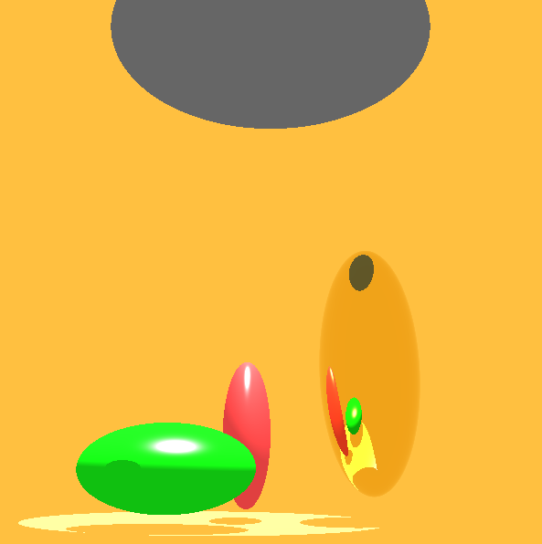

# Sunlight Tube Simulator

## Building with CMake

Build the `Makefile` with the following command!

```
cmake .
```

After that you can run the make command to build the app.

```
make
```

## Specification

A Velux a napfénycsöveit a beépítés előtt virtuális világban kívánja tesztelni. A feladatot önre osztott a sors arra az esetre, amikor a _napfénycső ezüst egzköpenyű hiperboloid_ és a _nap közvetlenül nem világít be a szobába_. A napfénycső által megvilágított _szobában_ legalább _három objektum_ van, amelyek szabadon megválaszhatók, de nem lehetnek gömbök. Az objektumokból legalább az egyik _optikailag sima arany_. A rücskös anyagok a diffúz+PhongBlinn modellt követik. Az nap+égbolt fénye konstans égbolt radianciával és a nap irányának környékén erősödő nap radianciával jellemezhető.

Az égbolt fény csak a csövön juthat be a szobába, ahol csak egy ambiens fényforrás van jelen. Feladat, a szobában lévő virtuális kamerából lefényképezni a látványt.

> Ezüst: n/k: 0.14/4.1, 0.16/2.3, 0.13/3.1

> Arany: n/k: 0.17/3.1, 0.25/2.7, 1.5/1.9

## Screenshot


